

# Game Server and AI for Triominos

## Purpose of this project

The purpose of this project is to experiment with:

* how to implement game play for Triominos with Java (applying TDD and Clean Code practices as much as possible)
* how different drawing and placement strategies can optimize for likelihood of victory by using AI for automated
  gameplay

## Gameplay

TODO

There exist several variants of the game regarding the game termination conditions and scoring rules. One rule-set can
be found [here](https://www.pressmantoy.com/wp-content/uploads/2018/01/Tri-Ominos.pdf).

## Terminology

### Tile, Number, Up-Facing, Down-Facing, Corner

A **tile** is a triangular piece, and it is the core element of the game.

It (obviously) has three **corner**s, where each corner has an assigned **number** in the range **0-5**.

Depending on the tile's orientation (see next section for a definition), it is either **up-facing** or **down-facing**.

Corners are referred to as **left**, **middle**, and **right** (when referring to a corner, this nomenclature is more
useful than using the conventional naming of corners with *A, B, C*, because it is independent of the orientation of a
tile).

A tile is denoted as ***"x-y-z"***, where x,y and z are the numbers of the left, middle and right corners, respectively
for base orientation *ABC*.

The following graphic visualizes the concepts introduced in this section:

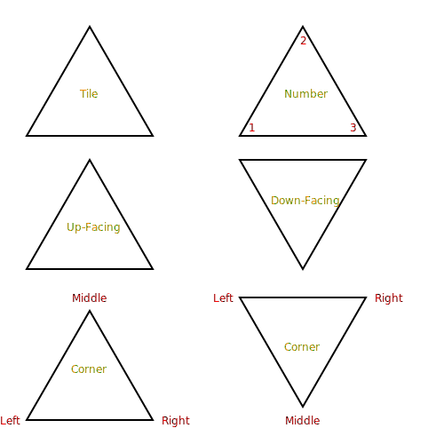

### Rotation, Orientation

The **orientation** of a tile can be changed by **rotating** it. There are six orientations: ***ABC, ACB, CAB, CBA, BCA,
BAC***.

Note: here the naming follows the conventional naming of triangle corners (instead of *left, middle, right*), because it
aids in understanding how the corner numbers change with each rotation.

For instance, the base orientation of the tile *"1-2-3"* is *ABC*. I.e., the left corner is "1", the middle corner is "
2", and the right corner is "3". After rotating the tile clockwise, it is in orientation *ACB*. Now, the left corner
is "1", the middle corner is "3", and the right corner is "2".

To exemplify the concept, all orientations for the tile *"1-2-3"* are depicted below:

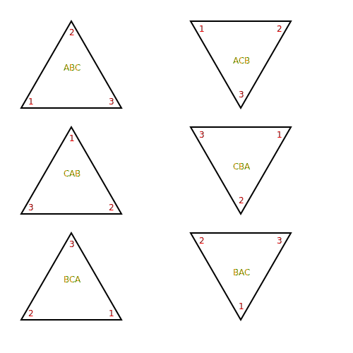

### Game Board, Coordinate System, Location

A **game board** is a set of slots, where tiles can be placed.

A 2D **coordinate system** is employed to specify where a tile is placed on the game board.

A tile is located by a tuple ***(x,y)***, where x (*horizontal*) and y (*vertical*) are the coordinates of the
**location**.

The center of the coordinate system is defined at *(0, 0)*.

Per definition, **only an up-facing tile can be placed at the center location**. Whether a tile must be placed up- or
down-facing at a location logically results from this requirement.

The following graphic visualizes the coordinate system.

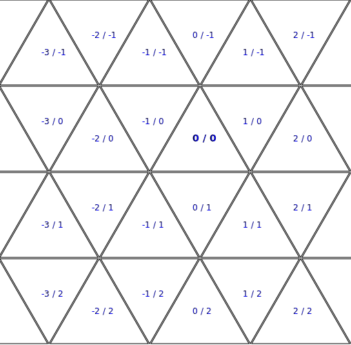

### Placement

A **placement** defines in which *orientation* and at which *location* a given *tile* should be placed on a game board.

For instance, a placement {*"1-2-3"*, *ACB*, *(-2,1)*}, places a tile *"1-2-3"* in orientation *ACB* at location
*(-2/1)*.

### Neighbors

Checking the validity of a placement or calculating its resulting score is a non-trivial task. Therefore, the following
neighbor names are defined to simplify referencing a neighboring location:
**left, right, middle, opposite, far-left, far-right, left-to-opposite, right-to-opposite, left-to-middle,
far-left-to-middle, right-to-middle, far-right-to-middle**.

The following graphics depict which name is referring to which neighbor (for both, up-facing and down-facing tiles).

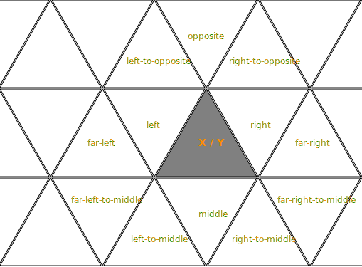

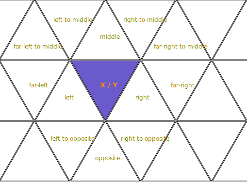

### (Semi-)Adjacent Placement

A placement has an **adjacent placement** if two corners of the placements are tangent. This is the case if a tile was
placed at its *left*, *middle*, or *right* neighbor location.

A placement has a **semi-adjacent placement** if a tile is placed at a neighboring location that only shares a single
corner with the placement. This is the case if a tile was placed at its *far-left, far-left-to-middle, left-to-middle,
right-to-middle, far-right-to-middle, far-right, right-to-opposite, opposite*, or *left-to-opposite* neighbor location.

### Valid placement

The first placement is valid, if it is placed at *(0,0)* for an up-facing tile and at *(1,0)* for a down-facing tile.

**Note**: The positional "normalization" to the center is enforced so that the size of the game board can be restricted
depending on the number of tiles in the game. The orientation enforcement allows to easily verify that the orientation
of two adjacent placements is opposing so that two corners are tangent.

Any subsequent placement is valid if:

- the tile's orientation and the orientation defined for the location are facing in the same direction
- no other tile has been placed at the location yet
- it has at least one existing adjacent placement
- for each existing adjacent placement, the values of the tangent corners match accordingly
- and captain obvious: the tile must be on the players tray

#### Examples

Consider the following board constellation.

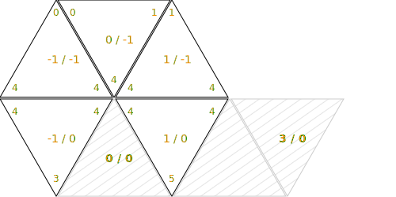

The following placements are invalid:

- {*3-4-5*, *ABC*, *(-1,-1)*}: location is already taken
- {*3-4-5*, *ACB*, *(0,0)*}: orientation of tile and location do not match
- {*2-4-5*, *ABC*, *(0,0)*}: tangent corners do not match with tile at *(-1, 0)*
- {*3-4-5*, *CAB*, *(0,0)*}: tangent corners do not match, neither for *(-1, 0)* nor for *(1, 0)*
- {*3-4-5*, *ACB*, *(0,0)*}: orientation of tile and location do not match
- {*3-4-5*, *BAC*, *(3,0)*}: no adjacent placement (*(1, 0)* is only semi-adjacent)

The only valid placement is: {*3-4-5*, *ABC*, *(0,0)*}

### Special figures

A placement may complete a **special figure**, resulting in a higher score. The different types of special figures are
described in the following sections.

#### Hexagon

A placement completes a **hexagon** if placements for all five neighbor locations around any of its corners exist
already. That is:

- for the left corner, placements must exist for the neighbors *left, far-left, far-left-to-middle, left-to-middle,
  middle*.
- for the middle corner, placements must exist for the neighbors *left, right, left-to-opposite, opposite,
  right-to-opposite*.
- for the right corner, placements must exist for the neighbors *right, far-right, far-right-to-middle, right-to-middle,
  middle*.

This reasoning can be better understood by looking at the graphic in the [Neighbors](#neighbors) section.

To detect a placement that completes multiple hexagons, simply check if hexagons are completed at multiple corners.

##### Example for Single Hexagon

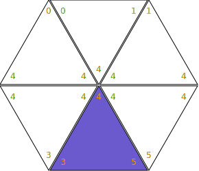

##### Example for Double Hexagon

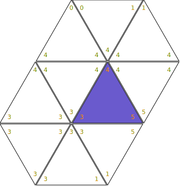

##### Example for Triple Hexagon

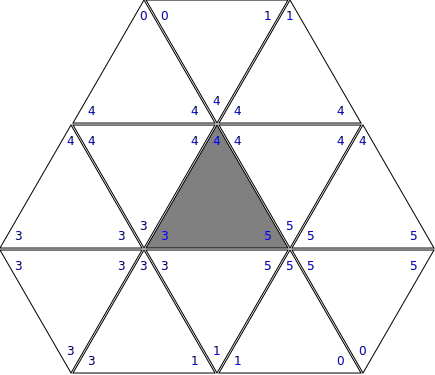

#### Bridge (Completed / Extended)

A placement completes a **bridge** if the corner opposite to an adjacent placement has one or more semi-adjacent
placement(s). That is:

- for an adjacent left neighbor, placements for any of the neighbors *far-left, far-left-to-middle, left-to-middle* must
  exist.
- for an adjacent middle neighbor, placements for any of the neighbors *opposite, left-to-opposite, right-to-opposite*
  must exist.
- for an adjacent right neighbor, placements for any of the neighbors *far-right, far-right-to-middle, right-to-middle*
  must exist.

This reasoning can be better understood by looking at the graphic in the [Neighbors](#neighbors) section.

##### Example for completed bridge

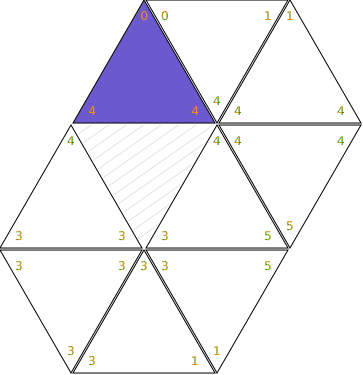

#### Example for extended bridge

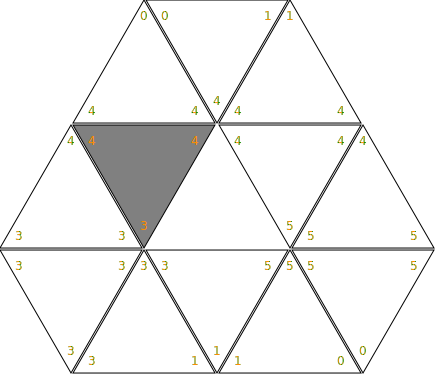

### Score

When a player plays a valid placement, a **score** is calculated for it. The following scoring rules apply:

- the base score is the sum of the corner numbers of the placed tile. E.g., placing a tile *"1-2-3"*
  results in a score of *6*. Placing a tile *"5-5-5"* result in a score of *15*.
- for a placement that completes a special figure, additional points are credited as follows:
    - a single hexagon:, 50 points
    - two hexagons:, 60 points
    - three hexagons:, 70 points
    - a completed or extended bridge: 40 points

### Tray

TODO

### Pool

TODO

### Turn

TODO

### Round

TODO

## Related work:

https://github.com/AgileBitFlipper/triominos
