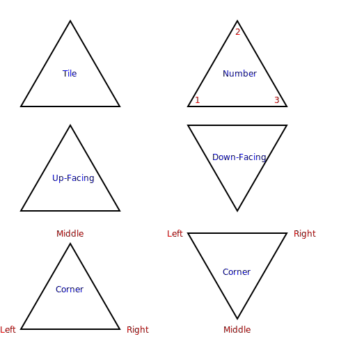

# Purpose of this project

*Note: Triominos is a game marketed and sold by Pressman Toy Corporation. In no way does this project intend to take
away any rights that Pressman has regarding the trademark Triominos.*

The purpose of this project is to experiment with:

* how to implement game play for Triominos with Java (applying TDD and Clean Code practices as much as possible)
* how different drawing and placement strategies can optimize for likelihood of victory by using AI for automated
  gameplay

# Rules

There exist several variants of the game. One rule-set can be
found [here](https://www.pressmantoy.com/wp-content/uploads/2018/01/Tri-Ominos.pdf).

# Terminology

## Tile, Number, Up-Facing, Down-Facing, Corner

A **tile** is a triangular piece, and it is the core element of the game. It (obviously) has three **corner**s, where
each corner has an assigned **number** in the range **0-5**. Depending on the tile orientation (see next section), it is
either **up-facing** or **down-facing**. Corners are referred to as **left**, **middle**, and **right** as depicted in
the graphic below. When referring to a corner, this nomenclature is more useful than using the classic naming of corners
with *A, B, C*, because it is independent of the orientation of a tile. In the remainder of this document, a tile is
denoted as *"x-y-z"*, where x,y and z are the values of the left, middle and right corner, respectively. E.g., *"1-2-3"*
matches the top right tile depicted in the following graphic.

## Rotation, Orientation

The **orientation** of a tile can be changed by **rotating** it. There are six orientations: **ABC, ACB, CAB, CBA, BCA,
BAC**.

The naming with letters *A, B, C* originates from the classical naming of triangle corners. Here, the letters *A, B, C*
were chosen instead of *left, middle, right*, because it aids understanding how the numbers change with each rotation.

For instance, the base orientation of the tile *"1-2-3"* is *ABC*. I.e., the left corner is "1", the middle corner is "
2", and the right corner is "3". After rotating the tile clockwise, it is in orientation *ACB*. Now, the left corner
is "1", the middle corner is "3", and the right corner is "2".

To exemplify this, all orientation for the tile *"1-2-3"* are depicted below:

## Coordinate System, Location

A 2D **coordinate system** is employed to specify where a tile is placed on the game board. Its center is defined at
the **location** *(0, 0)*. Per definition, only an up-facing tile can be placed at the center location. Whether a tile
must be placed up- or down-facing at a location logically results from this requirement. See the following graphic to
understand how the game board could look like with this coordinate system.

## Placement

A **placement** describes in which *orientation* and at which *location* a given *tile* should be placed.

For instance, a placement {*"1-2-3"*, *ACB*, *(-2,1)*}, places a tile *"1-2-3"* in orientation *ACB* at location
*(-2/1)*.

The first tile must be placed at *(0,0)* for an up-facing tile and at *(1,0)* for a down-facing tile. This
"normalization" is enforced so that the size of the game board can be restricted.

## Neighbors

Checking the validity of a placement or calculating its resulting score is a non-trivial task. Therefore, the following
neighbor names are defined to simplify referencing a neighboring location:
**left, right, middle, opposite, far-left, far-right, left-to-opposite, right-to-opposite, left-to-middle,
far-left-to-middle, right-to-middle, far-right-to-middle**.

The following graphics depict which name is referring to which neighbor (for both, up-facing and down-facing tiles).

## Adjacent Placement

A placement has an **adjacent placement** if a tile is already placed at its *left*, *middle*, or *right* neighbor
location.

## Valid placement

A placement is valid if:

- the tile orientation and location are facing in the same direction
- no other tile has been placed at the location yet
- the same tile has not been played yet
- it has at least one existing **adjacent placement**, i.e. a tile is already placed at its left, middle, or right
  neighbor location
- for each existing adjacent placement, the edges match accordingly

If it is the first placement, its location must also be either *(0/0)* or *(1/0)* (depending on the orientation).

## Special figures

A placement may complete a **special figure**. The different types of special figures are described in the following
sections.

### Hexagon

A placement completes a **hexagon** if placements for all five neighbor locations around any of its corners exist
already. That is:

- for the left corner, placements must exist for the neighbors *left, far-left, far-left-to-middle, left-to-middle,
  middle*.
- for the middle corner, placements must exist for the neighbors *left, right, left-to-opposite, opposite,
  right-to-opposite*.
- for the right corner, placements must exist for the neighbors *right, far-right, far-right-to-middle, right-to-middle,
  middle*.

This reasoning can be better understood by looking at the graphic in the [Neighbors](#neighbors) section.

To detect a placement that completes multiple hexagons, simply check if hexagons are completed at multiple corners.

#### Example for Single Hexagon

#### Example for Double Hexagon

#### Example for Triple Hexagon

### Bridge

A placement completes a **bridge** if the corner opposite to an adjacent placement has one or more **non-adjacent
placement(s)**. That is:

- for an adjacent left neighbor, placements for any of the neighbors *far-left, far-left-to-middle, left-to-middle* must
  exist.
- for an adjacent middle neighbor, placements for any of the neighbors *opposite, left-to-opposite, right-to-opposite*
  must exist.
- for an adjacent right neighbor, placements for any of the neighbors *far-right, far-right-to-middle, right-to-middle*
  must exist.

This reasoning can be better understood by looking at the graphic in the [Neighbors](#neighbors) section.

#### Bridge Completed

#### Bridge Extended

## Score

When a player plays a valid placement, a **score** is calculated for it. The following scoring rules apply:

- the base score is the sum of the corner numbers of the placed tile. E.g., placing a tile *"1-2-3"*
  results in a score of *6*. Placing a tile *"5-5-5"* result in a score of *15*.
- for a placement that completes a special figure, additional points are credited as follows:
    - a single hexagon:, 50 points
    - two hexagons:, 60 points
    - three hexagons:, 70 points
    - a completed or extended bridge: 40 points

# Related work:

https://github.com/AgileBitFlipper/triominos
